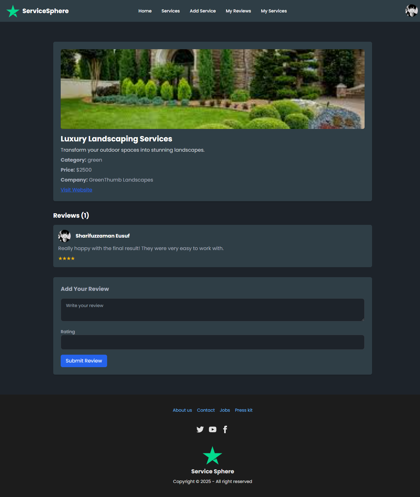
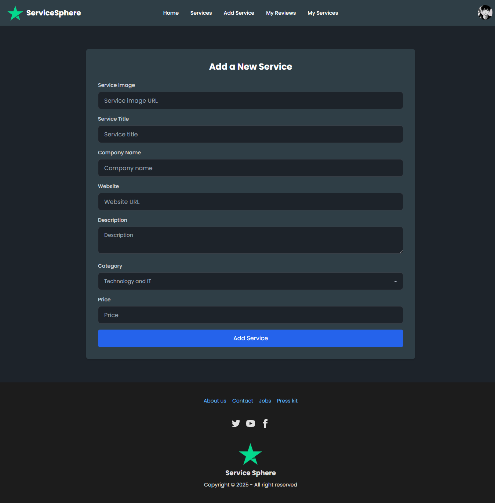
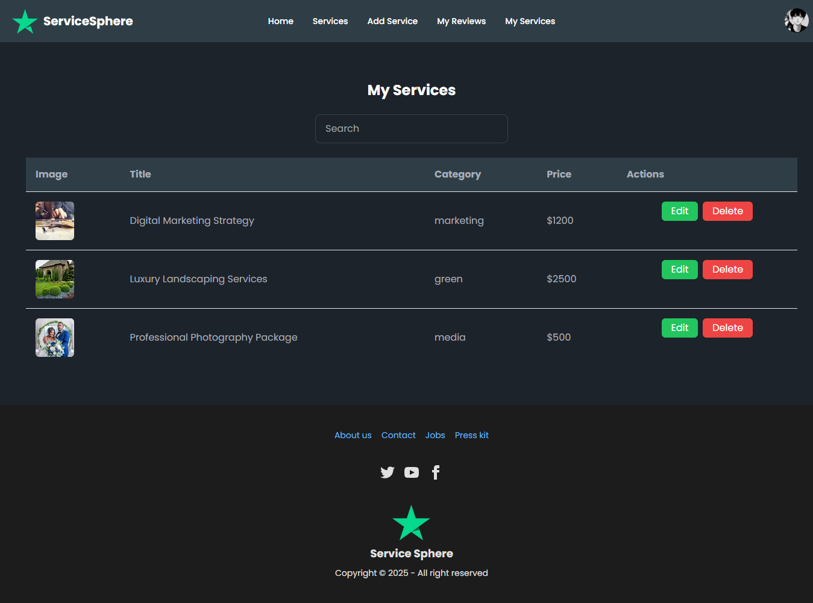
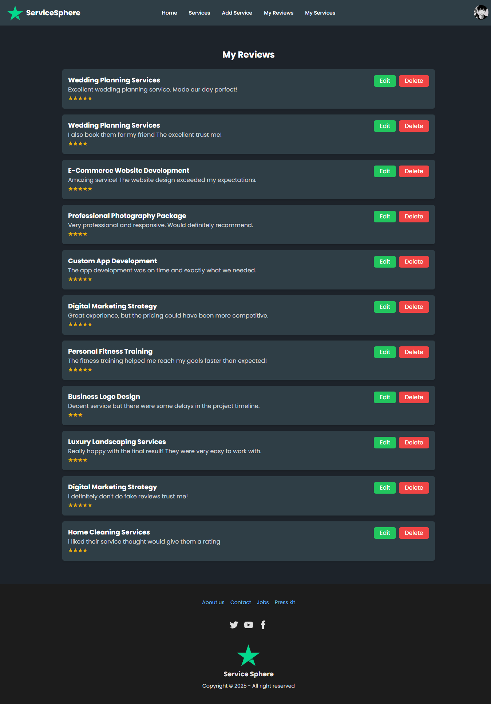
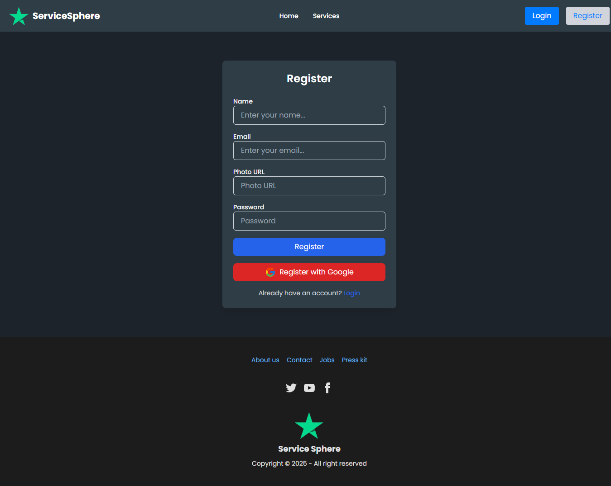
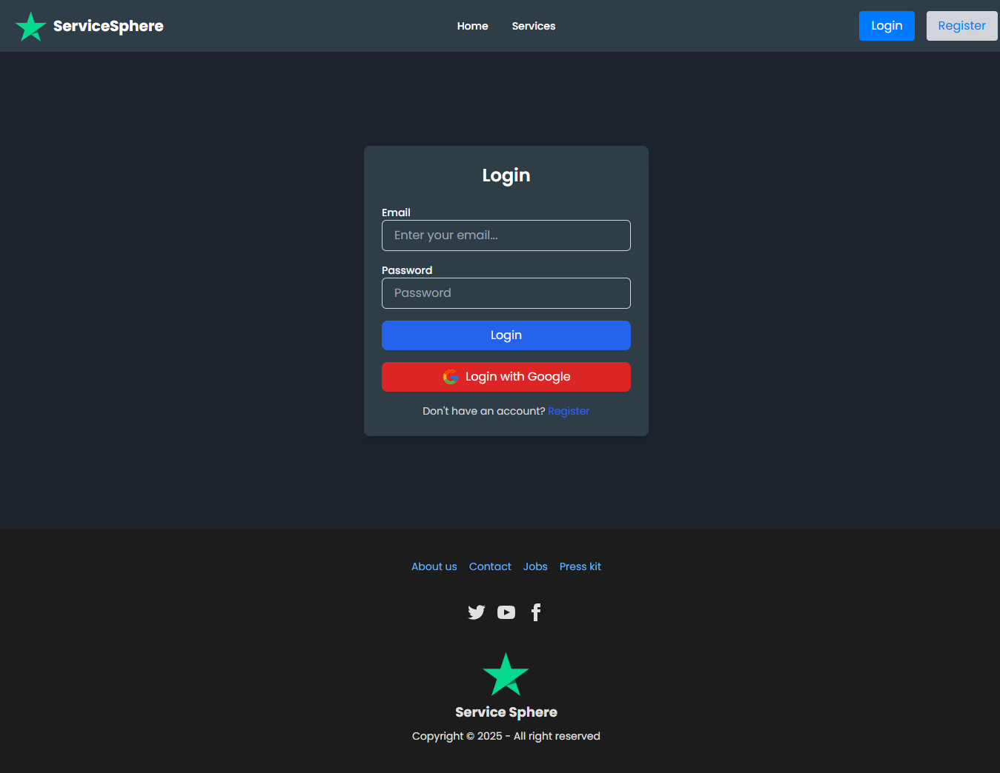

# ServiceSphere

## Project Overview
The **ServiceSphere** is a full-stack application that enables users to add, manage, and review services. This project showcases user authentication, CRUD operations, database security, responsive design, and advanced features such as JWT authentication and search functionality.

## Live URL
[Visit Live Website](https://service-sphere-21793.web.app/)

## Key Features
### User Capabilities
- **Add/Update/Delete Services**: Logged-in users can manage services they've created.
- **View Service Details**: Explore available services and read reviews.
- **Add/Edit/Delete Reviews**: Post, update, and delete reviews with ratings and textual feedback.
- **Manage My Reviews**: View and manage all reviews submitted by the logged-in user.

### Core Features
- **Responsive Design**: Fully functional across mobile, tablet, and desktop devices.
- **Dynamic Title**: Webpage title changes based on the route.
- **404 Page**: Custom "Not Found" page.
- **Search Functionality**: Search services by keywords such as title, category, or company name.
- **Filter Functionality**: Filter services by categories.
- **Countup Statistics**: Display statistics about total users, reviews, and services using react-countup.
- **JWT Authentication**: Secure user sessions and protect API routes.

## Deployment Guidelines
- **Client Deployment**: [https://service-sphere-21793.web.app/]
- **Server Deployment**: Hosted on [[Vercel](https://service-sphere-server.vercel.app/)]

## Technologies Used
- **Frontend**: React, React Router, Firebase Authentication, Tailwind CSS, Framer Motion.
- **Backend**: Node.js, Express.js, MongoDB.
- **Additional Libraries**:
  - sweetalert2
  - dotenv
  - react-countup

## Screenshots
### Home Page


### Services Page


### Service Details Page


### Add Service Page


### My Services Page


### My Reviews Page


### Registration Page


### Login Page


## Pages and Functionalities
### Navbar
- **Before Login**: Logo, Home, Services, Login, Register.
- **After Login**: Logo, Home, Services, Add Service, My Reviews, My Services, User Avatar, Logout.

### Home Page
- **Banner Section**: Image slider with text highlights using react slick slider.
- **Featured Services Section**: Displays 6 services with details and a "See Details" button.
- **Meet Our Partners**: Highlights collaborators with logos and descriptions.
- **Extra Sections**: Two additional sections a Testimonials section and a Call to Action section.

### Authentication Pages
- **Login**: Email/Password and Google login. Redirect link to register page.
- **Register**: User details validation with password requirements. Redirect link to login page.

### Service Management
- **Add Service**: Allows users to add service details securely.
- **Service Page**: Displays all services with a "See Details" button.
- **Service Details Page**: Showcases detailed information about a service and allows users to add reviews.
- **My Services Page**: Lists services created by the user with search, update, and delete options.

### Review Management
- **Add Review**: Post a review with text, rating, and user details.
- **My Reviews Page**: Lists user reviews with update and delete options.

### Additional Features
- **Spinner**: Displays during loading states.
- **Sweet Alert Notifications**: For all CRUD operations.

## Security Measures
- **Environment Variables**: Secure Firebase and MongoDB credentials.
- **JWT Authentication**: Protect sensitive API routes.

## Installation & Setup
1. Clone the repository:
   ```bash
   git clone <repository-url>
   ```
2. Navigate to the project directory:
   ```bash
   cd eco-adventure-blog
   ```
3. Install dependencies:
   ```bash
   npm install
   ```
4. Set up environment variables:
   - Create a `.env` file and add your Firebase keys:
     ```env
     REACT_APP_API_KEY=your_api_key
     REACT_APP_AUTH_DOMAIN=your_auth_domain
     REACT_APP_PROJECT_ID=your_project_id
     REACT_APP_STORAGE_BUCKET=your_storage_bucket
     REACT_APP_MESSAGING_SENDER_ID=your_messaging_sender_id
     REACT_APP_APP_ID=your_app_id
     ```
5. Run the development server:
   ```bash
   npm start
   ```

## Author
Sharifuzzaman Eusuf  
[Portfolio](https://sharifuzzaman.vercel.app/) | [Linkedin Profile](https://www.linkedin.com/in/sharifuzzaman24/)

---
Thank you for exploring **Service-Sphere**.


